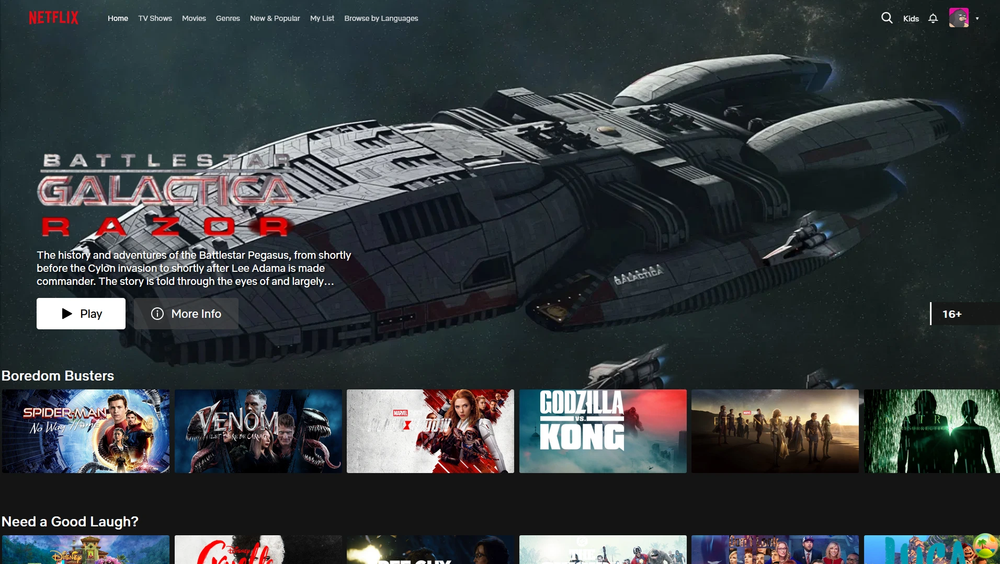

# Netflix Clone

A modern Netflix clone built with React and TypeScript.
🚧 **WIP**



## Demo

<div align="center">
  <a href="https://www.youtube.com/watch?v=N_vROtuFc3E">
    
  </a>
  <p><strong>▶️ Click to watch demo</strong></p>
</div>


## Tech Stack

- **React** - UI library
- **TypeScript** - Type safety
- **Vite** - Build tool
- **TanStack Query** - Data fetching
- **Zustand** - State management
- **React Router** - Navigation
- **Sass** - Styling
- **Axios** - HTTP client
- **TMDB API** - Movie/TV data

## API Endpoints

The app uses The Movie Database (TMDB) API v3:

- `/3/discover/movie` - Discover movies by genre/year
- `/3/discover/tv` - Discover TV shows by genre/year
- `/3/movie/{id}/videos` - Get movie trailers
- `https://image.tmdb.org/t/p/` - Movie poster/backdrop images

## Design Assets

UI design and assets from [Netflix Clone Figma Community](https://www.figma.com/community/file/967543658879972914)

## Quick Start

```bash
npm install
npm run dev
```

## Scripts

- `npm run dev` - Start development server
- `npm run build` - Build for production
- `npm run preview` - Preview production build
- `npm run lint` - Lint code
- `npm run format` - Format code